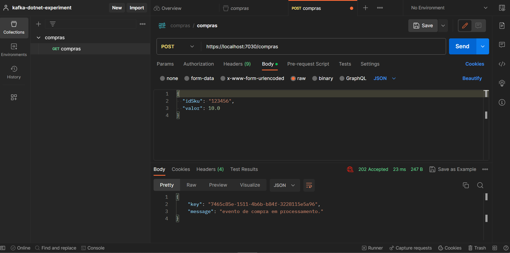

# Experiment

## Description
This repository addresses an experiment with the "fire-and-forget" design pattern.

An HTTP client makes a request and the api maps it to a business event. After sending it for processing in a kafka topic, a status code 202 (accepted) is returned.

As result, the restful api operates in low latency.

## Resources

### Postman

### Kafdrop

